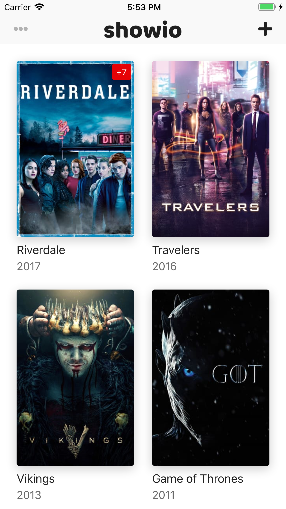
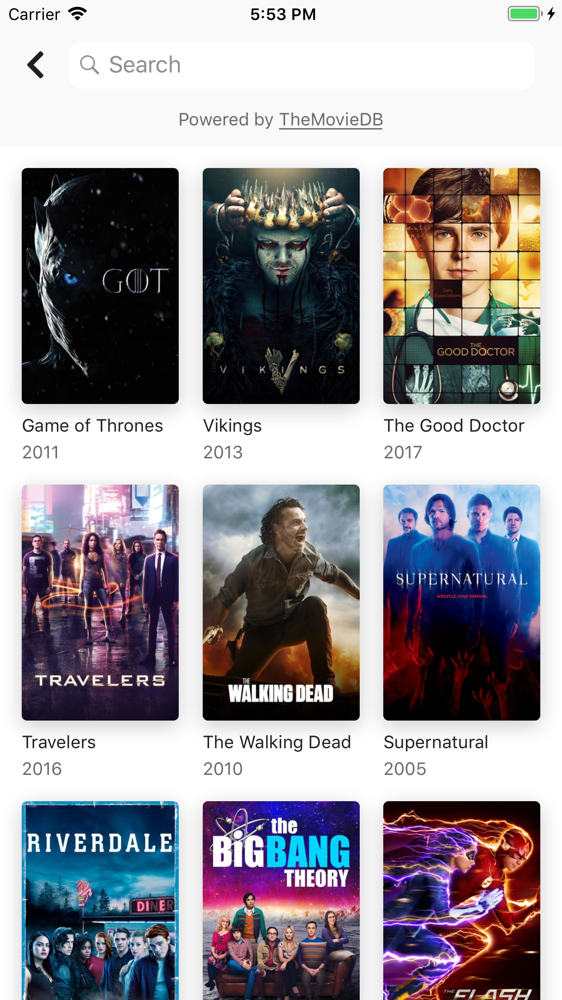

# Showio

<p align="center">
    
    
    
</p>

[50+ MB Demo GIF](assets/demo.gif)

## Features

- Pretty animations
- Works without internet
- Supports iPhone and iPad in all orientations

## Requirements

- iOS 10+
- Swift 5
- [TMDB API](https://www.themoviedb.org/documentation/api) Key

## Installation

1. Clone this repository and install dependencies:

    ```bash
    $ git clone git@github.com:madyanov/showio-app.git
    ```

2. Open `ShowTracker.xcworkspace` in the Xcode

3. Put your *TMDB API Key* to the `Config.plist` file

## Overview

- UI written in code
- [Coordinator pattern](http://khanlou.com/2015/10/coordinators-redux/) is used to separate view logic from business logic
- Core Data is used for local storage
- Async API provided by the [Promises Toolkit](https://github.com/madyanov/Promises)

## Further refactoring

- Data and domain layers should be refactored
- Separate UI, domain and storage models
- Split `ShowsService` and `ShowStorage`
- ...

## Links

- [AppStore](https://itunes.apple.com/app/id1445035408)
- [Site](https://madyanov.github.io/showio/)
